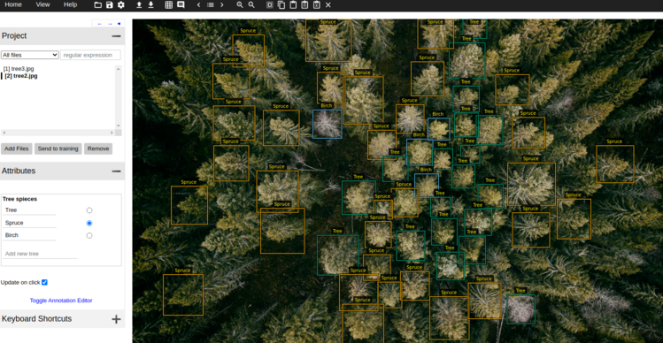

# Forest-classifier

## General info
This projects allows you to train two separate ML-models:
* Tree top bounding box detection.
* CNN tree species classification.

The GUI for adjusting the predictions is a modified version of the 
VGG Image Annotator tool.

All predictions are loaded into the GUI so that the user can correct classifications
and the bounding boxes, allowing for a fast way to create refined training data for 
both models at the same time.

The data is separated into:
* Cropped image of the tree tops - for the classifier.
* Bounding box data.

## GUI
In the GUI you can jump between all the predictions and adjust them as you want.
When you are happy with an image you simply press "send to training" that will create your 
training data.

Since the VGG tool is originally a website the GUI will open in your web browser.

Down below, you'll see an example of how a prediction looks when loaded into the GUI:

You can create new classes and create new bounding boxes as you please.

## Read more
* https://www.robots.ox.ac.uk/~vgg/software/via/via.html
* https://github.com/weecology/DeepForest
